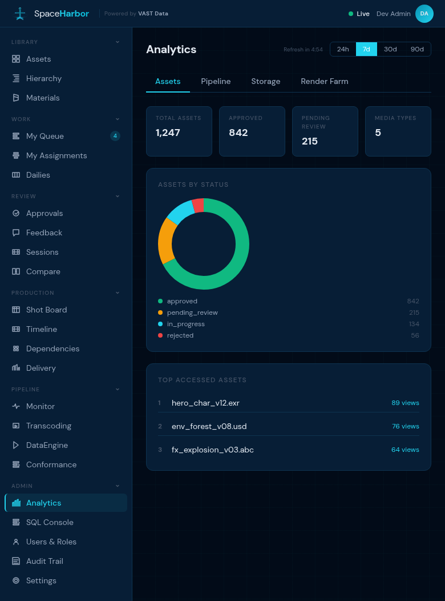
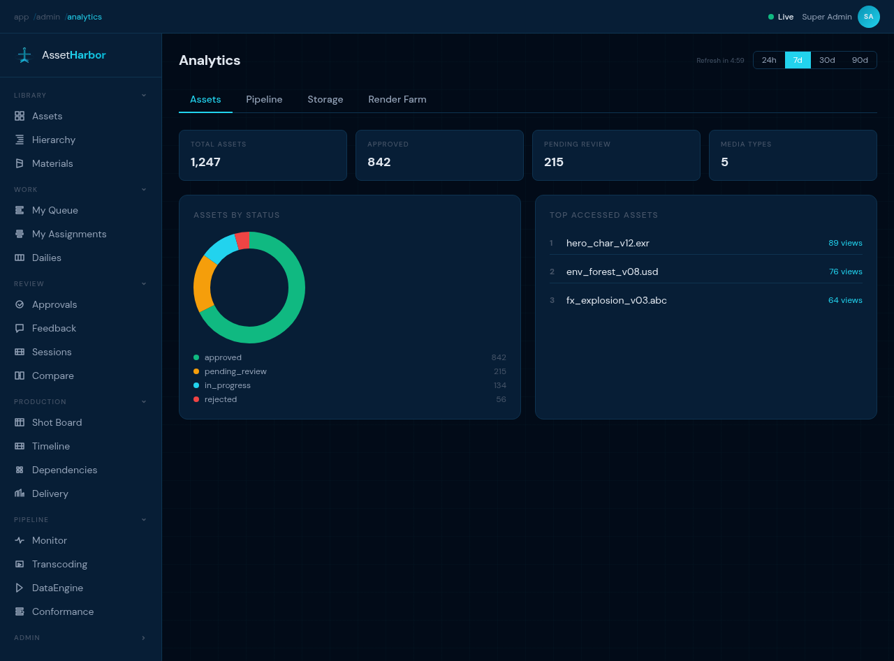

<p align="center">
  
</p>

<p align="center">
  <strong>VAST-Native Media Asset Management for Post-Production & VFX</strong>
</p>

<p align="center">
  <a href="LICENSE"></a>
  <a href="../../wiki"></a>
</p>

---

SpaceHarbor is a media asset management platform built on the [VAST Data Platform](https://vastdata.com). It provides asset ingest, metadata extraction, approval workflows, and VFX hierarchy management for post-production and visual effects studios.

## Key Capabilities

- **Asset Management** — Ingest, browse, search, and approve media assets (EXR sequences, video, DPX, images)
- **VFX Hierarchy** — Projects, sequences, shots, and versions with full lineage tracking
- **VAST-Native Pipeline** — DataEngine functions for EXR inspection, proxy generation, transcoding, and editorial conforming
- **Approval Workflows** — Review queues, approve/reject flows, and dailies playlists
- **Enterprise Identity** — Local auth, OIDC/SSO, SCIM provisioning, RBAC with role-based access control
- **Platform Settings** — Admin UI for VAST Database, Event Broker, DataEngine, and S3 storage configuration
- **Analytics** — Asset, pipeline, storage, and render farm dashboards

## Screenshots

<p align="center">
  
  <br><em>Platform Settings — VAST Database, Event Broker, DataEngine, S3</em>
</p>

<p align="center">
  
  <br><em>Analytics Dashboard</em>
</p>

## Architecture

```
┌─────────────┐     ┌──────────────────┐     ┌─────────────────────┐
│   Web UI    │────▸│  Control Plane   │────▸│   VAST Platform     │
│  React/Vite │     │  Fastify / Node  │     │                     │
└─────────────┘     └──────────────────┘     │  ▸ VAST Database    │
                           │                  │  ▸ VAST DataEngine  │
                    ┌──────┴──────┐           │  ▸ Event Broker     │
                    │  DataEngine │           │  ▸ S3 Object Store  │
                    │  Functions  │           │  ▸ VAST Catalog     │
                    │  (Python)   │           └─────────────────────┘
                    └─────────────┘
                    ▸ EXR Inspector      ▸ OIIO Proxy Generator
                    ▸ FFmpeg Transcoder  ▸ OTIO Parser
                    ▸ MaterialX Parser   ▸ Provenance Recorder
```

Storage access via NFS, SMB, and S3 — configurable per deployment.

## Quick Start

```bash
git clone https://github.com/xebyte/SpaceHarbor.git
cd SpaceHarbor

# Control plane
cd services/control-plane && npm ci && npm run dev

# Web UI (separate terminal)
cd services/web-ui && npm ci && npm run dev
```

Default dev login: `admin@spaceharbor.dev` / `Admin1234!dev`

See the [Wiki](../../wiki) for full deployment and configuration guides.

## Documentation

| Guide | Description |
|-------|-------------|
| [Wiki Home](../../wiki) | Documentation hub |
| [Quick Start](../../wiki/Quick-Start) | Get running in 5 minutes |
| [Deployment Guide](../../wiki/Deployment-Guide) | Production deployment |
| [Architecture](../../wiki/Architecture) | System design and decisions |
| [API Reference](../../wiki/API-Reference) | OpenAPI / Swagger docs |
| [Configuration](../../wiki/Configuration-Guide) | Settings and storage connectors |
| [Identity & Access](../../wiki/Identity-and-Access) | Auth, RBAC, SCIM |

## Tech Stack

- **Control Plane:** Fastify, TypeScript, tsx runtime
- **Web UI:** React 18, Vite, Tailwind CSS v4
- **DataEngine Functions:** Python (OpenEXR, FFmpeg, OIIO, OpenTimelineIO, MaterialX)
- **Persistence:** VAST Database (Trino), local in-memory for development
- **Events:** VAST Event Broker (Confluent Kafka)
- **Deployment:** Docker Compose

## License

Apache License 2.0 — see [LICENSE](LICENSE) for details.
