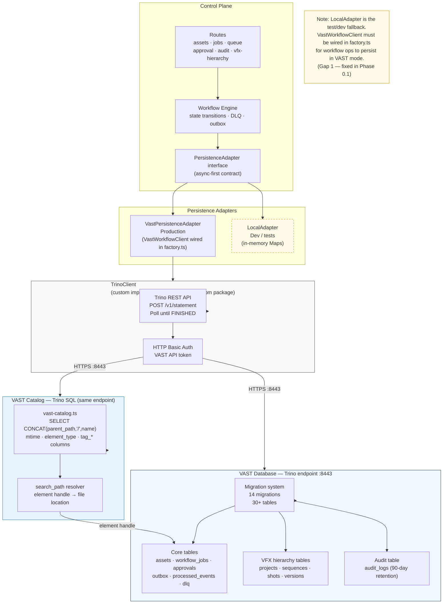

# Data and Query Flow

Shows the persistence layer topology: the Trino REST API client, the two adapter implementations (VastPersistenceAdapter for production and LocalAdapter for tests/dev), VAST Catalog queries using the correct indexed-column schema, and the migration system that governs the authoritative 30+ table schema.

