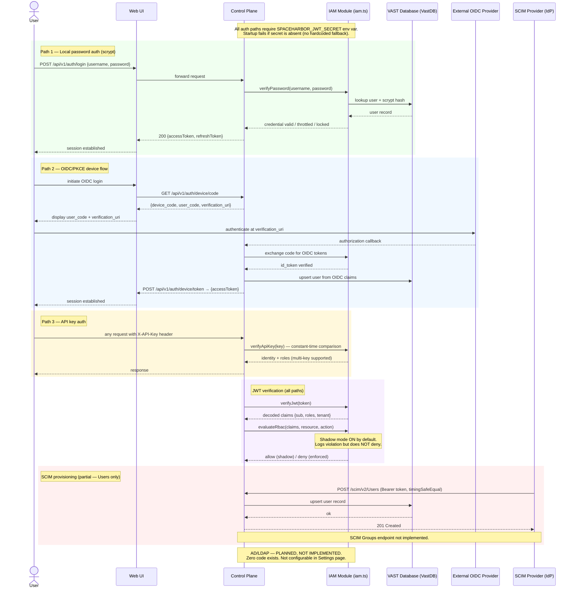

# Identity and Authentication Flow

Covers all implemented authentication paths: local password auth with scrypt, JWT issuance and verification, OIDC/PKCE device flow, and API key auth. RBAC evaluation is implemented but runs in shadow mode by default (no enforcement). SCIM user provisioning is partially implemented (Users endpoint; no Groups endpoint). AD/LDAP is planned but has zero implementation.

