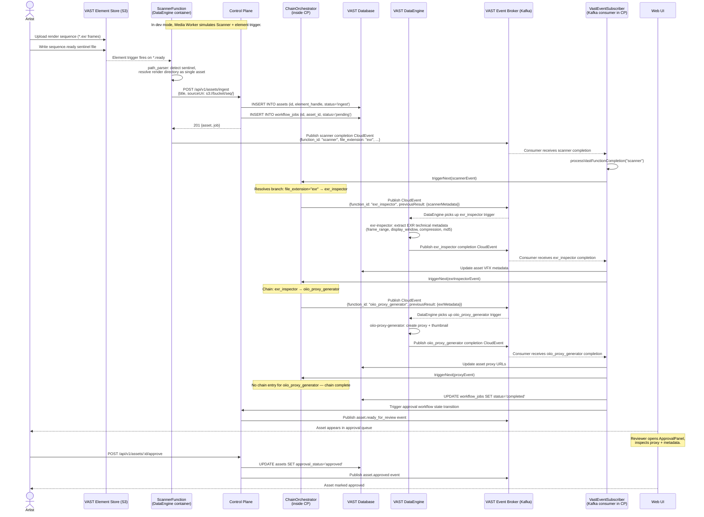

# Ingest Pipeline

End-to-end sequence for a media ingest. In production VAST environments the ScannerFunction is a VAST DataEngine container that detects `.ready` sentinel files and calls the control plane. The VAST element trigger then fires DataEngine processing functions automatically. In dev/local mode the Media Worker simulates both the scanner and the element trigger.

Function chaining (scanner → exr-inspector → oiio-proxy-generator for EXR, or scanner → ffmpeg-transcoder for video) is orchestrated by the control-plane `ChainOrchestrator`. See [ADR-006](../adr/006-control-plane-function-chaining.md) for rationale.



## Video ingest chain (alternative branch)

When the scanner detects a `.mov` or `.mp4` file, `ChainOrchestrator` routes to `ffmpeg_transcoder` instead of `exr_inspector`:

```
scanner (file_extension: mov/mp4) → ffmpeg_transcoder
```

## Post-processing chains

```
mtlx_parser → dependency_graph_builder
otio_parser  → timeline_conformer
```

These chains are triggered independently when a MaterialX or OTIO file is ingested. The same chaining mechanism applies: `VastEventSubscriber` calls `ChainOrchestrator.triggerNext()` after each function completes.
