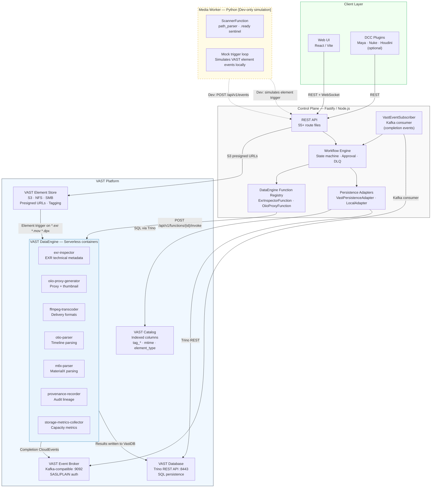

# Logical Architecture

High-level component view of SpaceHarbor. Shows all runtime services, the VAST platform services they depend on, and the DataEngine function containers that execute media processing pipelines. The Media Worker is dev-only and is not deployed against a production VAST cluster.

