# Storage Topology

Shows how SpaceHarbor resolves and accesses storage. The Protocol Resolver translates inbound source URIs into the correct protocol handler (NFS, SMB, or S3). VAST Catalog is queried via Trino SQL using the actual indexed column schema (not a separate `object_tags` table). Element handles — not file paths — are stored in asset records so metadata survives file moves.

```mermaid
graph LR
    subgraph Clients["Callers"]
        CP["Control Plane\nIngest route"]
        Scanner["ScannerFunction\nDev media worker"]
    end

    subgraph ProtocolResolver["Protocol Resolver\n(env-var configured)"]
        direction TB
        NFS["NFS handler\nNFSMOUNT_PATH env var"]
        SMB["SMB handler\nSMB_SHARE env var"]
        S3Handler["S3 handler\nVAST_S3_ENDPOINT env var"]
    end

    subgraph VASTStorage["VAST Element Store"]
        S3Bucket["S3 Bucket\nPath-style enforced"]
        ElementStore["Element Store\nImmutable element handles\nelem_abc123xyz"]
    end

    subgraph S3Client["S3 Client Operations"]
        Presigned["Presigned URL\nGET / PUT (time-limited)"]
        Tagging["Object Tagging\nfor Catalog indexing"]
    end

    subgraph VastCatalog["VAST Catalog  —  Trino SQL"]
        direction TB
        CatalogTable["Catalog table\nCONCAT(parent_path, '/', name) AS path\nmtime  ·  element_type\ntag_<key> indexed columns"]
        CatalogQuery["Tag queries\nWHERE tag_project = 'film1'\nNo object_tags JOIN table"]
    end

    subgraph VastDB["VAST Database  —  Trino REST"]
        AssetRecord["assets table\nelement_handle  (not path)\nthumbnail_element_handle\nproxy_element_handle"]
    end

    CP -->|"sourceUri: s3:// nfs:// smb://"| ProtocolResolver
    Scanner -->|file path| ProtocolResolver

    ProtocolResolver --> NFS
    ProtocolResolver --> SMB
    ProtocolResolver --> S3Handler

    S3Handler --> S3Client
    S3Client --> Presigned
    S3Client --> Tagging
    Presigned -->|upload / download| S3Bucket
    Tagging -->|tag metadata| S3Bucket

    S3Bucket --> ElementStore
    ElementStore -->|"elem_abc123xyz assigned"| AssetRecord
    ElementStore -->|"element_type, mtime, tag_*"| CatalogTable

    CatalogTable --> CatalogQuery
    CatalogQuery -->|search results| CP

    AssetRecord -->|element_handle lookup| ElementStore

    style VastCatalog fill:#e8f4fd,stroke:#2980b9
    style VASTStorage fill:#f0f8ff,stroke:#2c3e50
    style VastDB fill:#f0f8ff,stroke:#2c3e50
    style S3Client fill:#f9f9f9,stroke:#555
```

