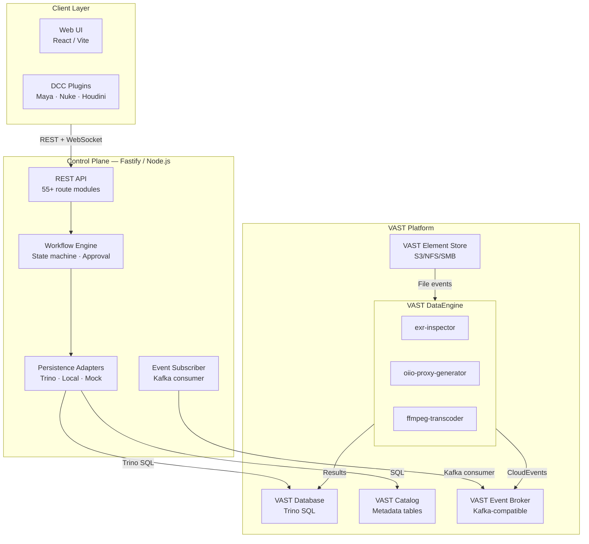

# Architecture Overview

SpaceHarbor is built as a **VAST-native system**, meaning it integrates deeply with VAST platform services rather than reimplementing storage or processing functionality.

## System Architecture

### Three-Layer Design



## Component Breakdown

### Client Layer

**Web UI** (React + Vite + TypeScript)
- Asset browser and search
- Ingest and upload interface
- Approval and QC panels
- Audit and compliance reporting
- Real-time status via WebSocket

**DCC Plugins** (Maya, Nuke, Houdini) — *Optional*
- Direct asset ingest from creative tools
- Quick preview and review
- Version tracking and publish

### Control Plane

**REST API** — 55+ route modules providing:
- Asset lifecycle (ingest, metadata, retrieval)
- Job queue management (claim, heartbeat, reap)
- Approval workflows (submit, review, approve)
- Audit and compliance (event logging, retention)

**Workflow Engine** — State machine managing:
- Asset status transitions (pending → processing → approved → archived)
- Multi-stage approval workflows
- Job failure recovery (DLQ, replay)
- Event publishing to VAST Event Broker

**VastEventSubscriber** — Kafka consumer that:
- Listens for VAST DataEngine completion events
- Correlates events to SpaceHarbor job records
- Updates asset metadata in VAST Database
- Triggers approval workflow transitions

**Persistence Adapters** — Abstraction layer supporting:
- **VastPersistenceAdapter** (production) → Trino SQL
- **LocalAdapter** (development) → In-memory JavaScript Maps
- **MockAdapter** (testing) → Pre-populated test data

### VAST Platform Services

**VAST Database (Trino)** — SQL-compatible data warehouse
- Stores all asset metadata and job state
- Supports complex queries for search and reporting
- Provides ACID transactions for data consistency

**VAST Catalog** — Metadata management
- Attached to Element handles (immutable file identifiers)
- Tag-based indexing for fast queries
- User-defined metadata fields

**VAST Event Broker (Kafka)** — Event streaming
- Durably stores workflow completion events
- Enables event-driven integration with external systems
- Supports consumer groups for reliability

**VAST Element Store** — File storage
- S3, NFS, or SMB-compatible protocols
- Presigned URLs for temporary access
- File versioning and recovery

**VAST DataEngine** — Serverless processing
- Runs containerized functions for media processing
- Triggered by Element events (file creation) or HTTP API
- Writes results back to VAST Database

## Key Design Principles

### 1. Element Handles as Source of Truth

Instead of storing file paths, SpaceHarbor references files by immutable **Element handles**. This solves the "broken links" problem:

```
Traditional MAM:
Asset { id: 123, path: "\\nas\projects\film1\shot_001.mov" }
                                    ↑
                        Breaks if file is moved

VAST-Native:
Asset { id: 123, elementHandle: "elem_abc123xyz" }
                                       ↑
                         Valid forever, file can move anywhere
```

### 2. Event-Driven Everything

All state changes propagate through VAST Event Broker:

```
File Uploaded
  → Element event → DataEngine processes
    → Completion event → VastEventSubscriber → Updates status
      → Asset ready for approval → Web UI reflects change
```

### 3. VAST DataEngine Owns Processing

The control-plane orchestrates, DataEngine executes. This provides:
- **Serverless scaling** — VAST manages infrastructure
- **Cost efficiency** — Pay per execution, not per instance
- **Reliability** — Built-in retry and error handling
- **Isolation** — Functions run in containers, not in the API process

### 4. Dual-Mode Persistence

The persistence adapter pattern enables:

| Mode | Adapter | Use Case |
|------|---------|----------|
| **Local** | In-memory JavaScript Maps | Development, testing, UI exploration |
| **Production** | VAST Trino via REST API | Real deployments with durability |

No code changes needed—configuration selects the adapter.

### 5. Async-First Design

All data operations return Promises:

```typescript
interface PersistenceAdapter {
  fetch(table: string, query: object): Promise<object[]>;
  insert(table: string, row: object): Promise<string>;
  update(table: string, query: object, delta: object): Promise<void>;
}
```

This enables:
- Non-blocking I/O
- Concurrent request handling
- Efficient resource utilization
- Natural WebSocket/SSE integration

## Data Model

### Core Tables

**assets**
- ID (UUID), element_handle (immutable reference), title, description
- Technical metadata (media_type, resolution, frame_rate, codec)
- Status (ingest, processing, approved, archived)
- Tracking (created_at, approved_at, approved_by)

**workflow_jobs**
- ID, asset_id (FK), stage (probe, transcode, approval)
- Status (pending, processing, completed, failed)
- Processing info (started_at, completed_at, duration_seconds)
- VAST DataEngine integration (job_id, status)

**approvals**
- ID, asset_id (FK), reviewer_id, review_status (approved, rejected, revise_requested)
- Feedback (issues, revision_requests)
- Timeline (reviewed_at, created_at)

**audit_log**
- ID, correlation_id, actor_id, action, resource_id
- Result (success/failure), metadata
- Created_at for compliance retention

## Event Flow

### Complete Asset Lifecycle

```
1. User uploads file to VAST Element Store
   ↓
2. VAST element trigger fires → DataEngine starts pipeline
   ↓
3. exr-inspector runs → Extracts metadata
   ↓
4. DataEngine publishes "dataengine.job.completed" CloudEvent
   ↓
5. VastEventSubscriber consumes event
   ↓
6. Control-plane updates asset status and metadata in VAST Database
   ↓
7. WebSocket sends update to Web UI
   ↓
8. Asset appears in approval queue
   ↓
9. Reviewer approves or requests revisions
   ↓
10. Status updated, event published
    ↓
11. Asset moves to archive or published state
```

## API Contracts

SpaceHarbor exposes a OpenAPI 3.0 specification:

```bash
GET /openapi.json     # Full OpenAPI document
GET /docs             # Interactive Swagger UI (dev only)
```

Key endpoint groups:

| Group | Purpose | Examples |
|-------|---------|----------|
| **Assets** | Manage media files | POST /api/v1/assets/ingest, GET /api/v1/assets |
| **Jobs** | Track processing | GET /api/v1/jobs/:id, POST /api/v1/queue/claim |
| **Queue** | Job scheduling | GET /api/v1/jobs/pending, POST /api/v1/queue/reap-stale |
| **Approval** | Review workflows | POST /api/v1/approvals, GET /api/v1/approvals/:id |
| **Events** | Event streaming | WebSocket: /events/stream, REST: POST /api/v1/events |
| **Audit** | Compliance logs | GET /api/v1/audit |
| **Health** | System status | GET /health, GET /api/v1/metrics |

See [API Reference](API-Reference.md) for detailed documentation.

## Architecture Decisions

Key decisions are documented in Architecture Decision Records (ADRs):

- **ADR-001** — Why VAST-native (element handles over file paths)
- **ADR-002** — Why event-driven (Kafka over HTTP polling)
- **ADR-003** — Why dual-mode persistence (dev fallback strategy)
- **ADR-004** — Why Fastify over Express
- **ADR-005** — Why Confluent Kafka client over kafkajs
- **ADR-006** — Control-plane function chaining orchestration
- **ADR-007** — Why OIDC/SCIM (deferred AD/LDAP)

## Deployment Topologies

### Single-Instance (Development)

```
Web UI → Control-plane (port 3000)
         ↓
         VAST Trino (local or remote)
         ↓
         VAST Event Broker (optional, mocked locally)
```

### Multi-Instance (Production)

```
Load Balancer (Nginx / HAProxy)
         ↓
    ┌────┴────┬────────┐
    ↓         ↓        ↓
   CP-1      CP-2     CP-3
    └────┬────┴────┬──┘
         ↓         ↓
    VAST Trino   VAST Event Broker
```

All control-plane instances share:
- Same VAST Database (Trino)
- Same Event Broker (Kafka consumer group)
- Stateless design (can be scaled horizontally)

### Kubernetes (Enterprise)

See [Deployment Guide](Deployment-Guide.md) for Kubernetes-specific setup.

## Media Processing Pipeline

VAST DataEngine executes these functions in sequence:

```mermaid
graph LR
    File["File Ingested"] → Probe["EXR Inspector<br/>(metadata)"]
    Probe → Transcode["FFmpeg Transcoder<br/>(proxies)"]
    Transcode → Thumb["OIIO Proxy<br/>(thumbnails)"]
    Thumb → Ready["Asset Ready<br/>for Review"]

    style File fill:#fff3cd
    style Probe fill:#d1ecf1
    style Transcode fill:#d1ecf1
    style Thumb fill:#d1ecf1
    style Ready fill:#d4edda
```

Each function:
- Runs in a container on the VAST cluster
- Reads input from Element Store
- Writes results to VAST Database
- Publishes completion events to Event Broker
- Can be registered dynamically

See [Pipeline and Functions](Pipeline-and-Functions.md) for function details.

## Failure Handling

### Retry Strategy

Jobs retry with exponential backoff:

```
Attempt 1: immediate
Attempt 2: +1 second
Attempt 3: +2 seconds
Attempt 4: +4 seconds
...
Max 3 attempts → Move to Dead-Letter Queue (DLQ)
```

DLQ jobs can be replayed manually:

```bash
curl -X POST http://localhost:3000/api/v1/jobs/:id/replay
```

### Fallback Mode

If VAST Database becomes unavailable:

- **Strict mode** (`SPACEHARBOR_VAST_STRICT=true`) — Return 503, refuse writes
- **Fallback mode** (default) — Use local in-memory storage, emit `VAST_FALLBACK` audit signal

Once VAST is restored, pending writes are replayed.

## Security Considerations

### Authentication

- Local auth (development): email/password
- JWT (production): Bearer tokens with expiry
- API keys: Service-to-service calls
- OIDC/SSO: Enterprise identity integration

### Authorization

- Role-based access control (RBAC)
- Fine-grained permissions per resource
- Audit trail of all access
- Shadow mode for safe policy rollout

### Data Protection

- TLS 1.2+ for all network communication
- Secrets never logged or exposed
- Presigned URLs for temporary file access
- Encryption at rest (VAST Database and Element Store)

## See Also

- [Deployment Guide](Deployment-Guide.md) — Production setup
- [Configuration Guide](Configuration-Guide.md) — Fine-tune settings
- [API Reference](API-Reference.md) — Endpoint documentation
- [Pipeline and Functions](Pipeline-and-Functions.md) — Processing details
