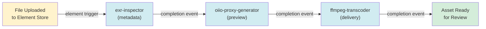

# Pipeline and Functions

Media processing pipeline and serverless function library.

## DataEngine Architecture

SpaceHarbor uses VAST DataEngine for all media processing. The control-plane orchestrates; DataEngine executes in containers on the VAST cluster.

### Function Execution Models

**Element Trigger** (Automatic)
- File written to VAST Element Store
- Element event fires (S3 only, not NFS)
- Registered function executes automatically

**HTTP API** (On-Demand)
- Control-plane calls DataEngine REST API
- Explicit function invocation
- Used for workflows not triggered by file events

### Processing Pipeline

Default pipeline when asset is ingested:



## Built-In Functions

### exr-inspector

**Purpose:** Extract technical metadata from EXR files

**Trigger:** Element event on `*.exr` creation

**Extracts:**
- Frame range (first frame, last frame)
- Display window and data window
- Pixel aspect ratio
- Color space and compression
- Channel layout
- Software version

**Output:** Writes metadata to asset record in VAST Database

**Configuration:**

```bash
# In VAST DataEngine
exr-inspector:
  image: spaceharbor/exr-inspector:latest
  env:
    VAST_TRINO_ENDPOINT: $VAST_TRINO_ENDPOINT
    VAST_TRINO_USERNAME: $VAST_TRINO_USERNAME
    VAST_TRINO_PASSWORD: $VAST_TRINO_PASSWORD
```

### oiio-proxy-generator

**Purpose:** Create lightweight preview and thumbnail images

**Trigger:** Element event on `*.exr`, `*.dpx`, `*.tif`

**Generates:**
- Proxy video (H.264, 1/4 resolution) for quick preview
- JPEG thumbnail (250x250 px)

**Output:**
- Writes proxy file to Element Store
- Writes thumbnail to Element Store
- Updates asset record with URIs

**Configuration:**

```bash
oiio-proxy-generator:
  image: spaceharbor/oiio-proxy:latest
  env:
    PROXY_RESOLUTION: "1920x1080"
    PROXY_BITRATE: "2000k"
    THUMBNAIL_SIZE: "250x250"
```

### ffmpeg-transcoder

**Purpose:** Create delivery formats and multiple codecs

**Trigger:** Manual invocation via API (not automatic)

**Transcodes To:**
- ProRes 422 (for editorial)
- H.264 MP4 (for web preview)
- DCP (cinema distribution)

**Output:**
- Writes transcoded files to Element Store
- Updates asset record with delivery URIs

**Usage:**

```bash
POST /api/v1/assets/:assetId/transcode
Content-Type: application/json

{
  "codec": "prores422",
  "resolution": "1920x1080",
  "bitrate": "500m"
}
```

**Configuration:**

```bash
ffmpeg-transcoder:
  image: spaceharbor/ffmpeg-transcoder:latest
  env:
    FFMPEG_PRESET: fast  # ultrafast | superfast | veryfast | fast | medium | slow
    FFMPEG_CRF: 23       # Quality: 0-51 (lower = better)
```

### otio-parser

**Purpose:** Parse timeline files (EDL, OTIO)

**Trigger:** Element event on `*.otio`, `*.edl`

**Parses:**
- Clip definitions
- In/Out frames and reel references
- Transition metadata

**Output:**
- Writes timeline structure to VAST Database
- Creates asset records for each clip

**Configuration:**

```bash
otio-parser:
  image: spaceharbor/otio-parser:latest
```

### mtlx-parser

**Purpose:** Parse MaterialX shaders

**Trigger:** Element event on `*.mtlx`

**Parses:**
- Material definitions
- Shader networks
- Parameter values

**Output:**
- Indexes material structure for search
- Enables material reuse across projects

**Configuration:**

```bash
mtlx-parser:
  image: spaceharbor/mtlx-parser:latest
```

### provenance-recorder

**Purpose:** Log processing history and lineage

**Trigger:** Runs after every function completes

**Records:**
- Function name and version
- Input parameters
- Execution time
- Output URIs
- Software versions used

**Output:**
- Writes to audit log
- Enables "what was used to create this" queries

### storage-metrics-collector

**Purpose:** Monitor VAST Element Store capacity

**Trigger:** Scheduled daily

**Collects:**
- Total stored data (bytes)
- Growth rate
- File count by type
- Oldest/newest files

**Output:**
- Metrics exposed to monitoring system
- Triggers alerts if capacity > 80%

## Custom Functions

### Register a Custom Function

1. **Create a containerized function:**

```python
# my-function/main.py
import json
import sys

def process(input_uri: str, params: dict) -> dict:
    """Your processing logic"""
    # Read input
    # Process
    # Write output
    result = {
        "output_uri": "s3://bucket/output.exr",
        "metadata": {
            "processed_at": "2026-03-23T10:00:00Z",
            "custom_field": "value"
        }
    }
    return result

if __name__ == "__main__":
    input_data = json.loads(sys.stdin.read())
    result = process(input_data["inputUri"], input_data["params"])
    print(json.dumps(result))
```

2. **Push image to registry:**

```bash
docker build -t myregistry/my-function:v1.0.0 my-function/
docker push myregistry/my-function:v1.0.0
```

3. **Register with DataEngine:**

```bash
# Via VAST DataEngine API or UI
vastcmd dataengine function register \
  --name my-custom-function \
  --image myregistry/my-function:v1.0.0 \
  --trigger "*.custom"
```

4. **Invoke from control-plane:**

```bash
POST /api/v1/functions/my-custom-function/invoke
Content-Type: application/json

{
  "assetId": "asset-uuid",
  "params": {
    "quality": "high",
    "output_format": "exr"
  }
}
```

## Function Chaining

Define multi-stage pipelines:

```bash
# pipeline.yaml
name: render-to-delivery
stages:
  - name: validate
    function: exr-validator

  - name: proxy
    function: oiio-proxy-generator
    dependsOn: validate

  - name: transcode
    function: ffmpeg-transcoder
    dependsOn: proxy
    params:
      codec: prores422

  - name: audit
    function: provenance-recorder
    dependsOn: transcode
```

Register and invoke:

```bash
# Register pipeline
vastcmd dataengine pipeline register --file pipeline.yaml

# Invoke
POST /api/v1/pipelines/render-to-delivery/invoke
Content-Type: application/json

{
  "assetId": "asset-uuid"
}
```

Control-plane monitors each stage:
- If stage fails, retry with backoff
- On success, trigger next stage via event
- On max retries, move to DLQ

## Sentinel File Pattern

Use sentinel files to trigger processing:

1. **Upload primary asset:**
   ```
   s3://bucket/shot_001_v02.exr
   ```

2. **Create `.ready` sentinel file:**
   ```
   s3://bucket/shot_001_v02.exr.ready
   ```

3. **Scanner detects `.ready` marker**
   - Confirms file is fully written
   - Triggers registered function pipeline

**Typical workflow (from render farm):**

```bash
# Render farm uploads sequence
s3 upload shot_001_v02.exr

# Once verified, creates sentinel
touch shot_001_v02.exr.ready

# Element event fires on .ready
# Registered pipeline executes
```

## Error Handling

### Function Failure

If a function fails:

1. **Attempt retry** with exponential backoff
   - Attempt 1: immediate
   - Attempt 2: +5 seconds
   - Attempt 3: +10 seconds
   - Max 3 attempts

2. **On max retries:**
   - Job moves to DLQ
   - Asset status: `failed`
   - Operator reviews logs

3. **Manual recovery:**

```bash
# Check DLQ
curl http://localhost:3000/api/v1/dlq

# Review logs
vastcmd dataengine function logs --name exr-inspector --job job-uuid

# Replay job
curl -X POST http://localhost:3000/api/v1/jobs/:jobId/replay
```

## Monitoring Functions

### Health Check

```bash
GET /api/v1/functions/status
```

Response:
```json
{
  "functions": [
    {
      "name": "exr-inspector",
      "status": "healthy",
      "lastInvocation": "2026-03-23T10:00:00Z",
      "successCount": 1042,
      "failureCount": 3,
      "avgDuration_ms": 2500
    }
  ]
}
```

### Performance Metrics

```bash
GET /api/v1/functions/:name/metrics
```

Response:
```json
{
  "name": "exr-inspector",
  "invocations": 1045,
  "successes": 1042,
  "failures": 3,
  "avgDuration_ms": 2500,
  "p95Duration_ms": 5000,
  "p99Duration_ms": 8000,
  "totalDataProcessed_gb": 156.3
}
```

## See Also

- [Architecture Overview](Architecture.md) — Processing model
- [API Reference](API-Reference.md) — Function invocation endpoints
- [Configuration Guide](Configuration-Guide.md) — DataEngine setup
